# 🏢 Microsoft 365 / Entra ID Python Automation Enterprise Lab


## 📌 Project Overview

This project is an enterprise-style **Microsoft 365 / Microsoft Entra ID automation lab** built with **Python** and the **Microsoft Graph API**.

The purpose of this lab is to simulate real-world IT administration workflows such as user provisioning, user offboarding, security group management, user inventory reporting, department reporting, and automation logging.

Instead of performing identity administration manually through the Microsoft Entra admin center, this project uses Python scripts to automate repeatable Microsoft 365 administrative tasks.

---

## 🎯 Business Value

In a real organization, IT teams frequently need to create users, update employee attributes, disable accounts, manage group membership, and generate audit-ready reports. Doing this manually is slow, repetitive, and error-prone.

This lab demonstrates how automation can improve:

- ✅ User onboarding speed
- ✅ Offboarding consistency
- ✅ Directory accuracy
- ✅ Security group management
- ✅ Audit readiness
- ✅ Reporting visibility
- ✅ Operational efficiency

---

## 🧰 Technologies Used

| Technology | Purpose |
|---|---|
| **Python** | Core automation scripting |
| **Microsoft Graph API** | Programmatic access to Microsoft 365 / Entra ID |
| **Microsoft Entra ID** | Identity and access management platform |
| **Azure App Registration** | Secure API authentication |
| **OAuth 2.0 Client Credentials Flow** | Non-interactive service authentication |
| **Requests** | REST API calls to Microsoft Graph |
| **Pandas** | CSV processing and report generation |
| **python-dotenv** | Environment variable management |
| **CSV** | Bulk onboarding/offboarding input and report output |
| **GitHub** | Version control and portfolio documentation |

---

## 🧱 Lab Architecture

The diagram below illustrates the end-to-end workflow of the automation solution, from CSV input files through Python automation and Microsoft Graph API integration to Microsoft Entra ID and generated reports.

<p align="center">
  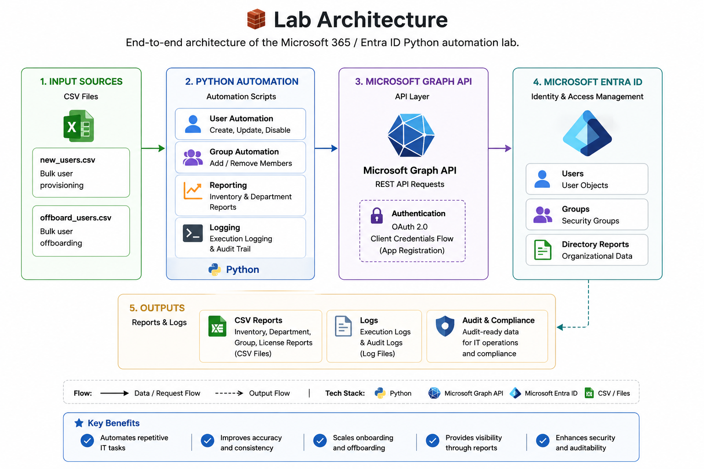
</p>

---

## 📂 Repository Structure

```text
m365-entra-python-automation-lab/
│
├── data/
│   ├── new_users.csv
│   └── offboard_users.csv
│
├── outputs/
│   ├── logs/
│   └── reports/
│
├── screenshots/
│   ├── 01_app_registration.png
│   ├── 02_graph_api_permissions.png
│   ├── 03_graph_connection_success.png
│   └── ...
│
├── scripts/
│   ├── 01_test_connection.py
│   ├── 02_export_users.py
│   ├── 03_create_user.py
│   ├── 04_disable_user.py
│   ├── 06_add_user_to_group.py
│   ├── 07_remove_user_from_group.py
│   ├── 08_update_user.py
│   ├── 09_bulk_create_users.py
│   ├── 10_bulk_offboard_users.py
│   ├── 11_department_report.py
│   ├── 12_group_inventory_report.py
│   ├── 13_license_report.py
│   └── 14_logging_demo.py
│
├── .gitignore
├── LICENSE
├── README.md
└── requirements.txt
```

---

## 🔐 Secure Microsoft Graph Authentication

This lab uses a Microsoft Entra **App Registration** to authenticate Python scripts to Microsoft Graph.

The app registration uses:

- Tenant ID
- Client ID
- Client Secret
- Microsoft Graph API permissions
- OAuth 2.0 client credentials flow

Sensitive values are stored locally in a `.env` file and excluded from GitHub.

### App Registration

The automation app was registered in Microsoft Entra ID to allow Python scripts to authenticate securely against Microsoft Graph.

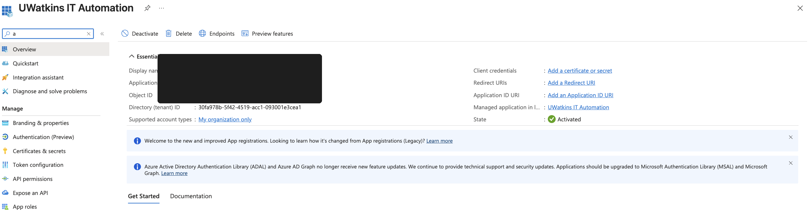

### Microsoft Graph API Permissions

The app was granted Microsoft Graph permissions required for user, group, and directory automation.

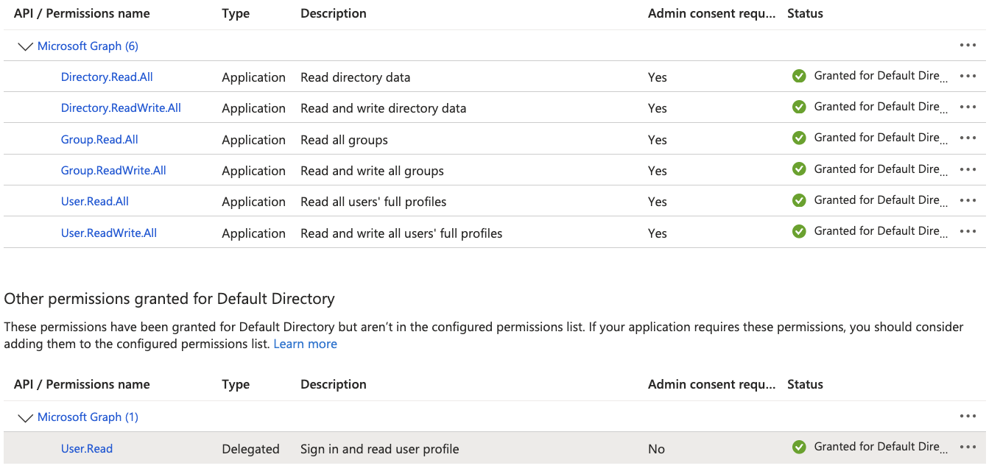

---

## ✅ Microsoft Graph Connection Test

The first script validates that the Python environment can successfully authenticate to Microsoft Graph and retrieve users from Microsoft Entra ID.

```bash
python scripts/01_test_connection.py
```

**Result:** Successful authentication to Microsoft Graph and retrieval of initial Entra ID users.

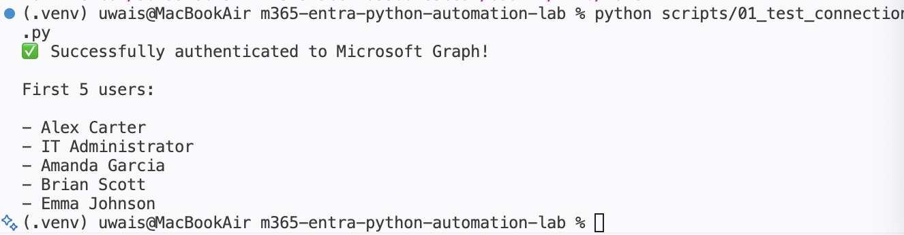

---

## 📤 User Inventory Export

The user export script retrieves Microsoft Entra ID user details and saves them into a CSV inventory report.

```bash
python scripts/02_export_users.py
```

**Business value:** Provides IT teams with a repeatable way to export directory inventory for audits, documentation, and operational reporting.

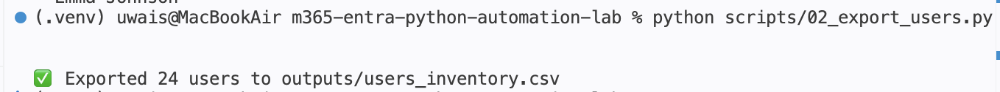

The generated CSV includes user profile fields such as display name, user principal name, job title, department, company name, office location, and account status.

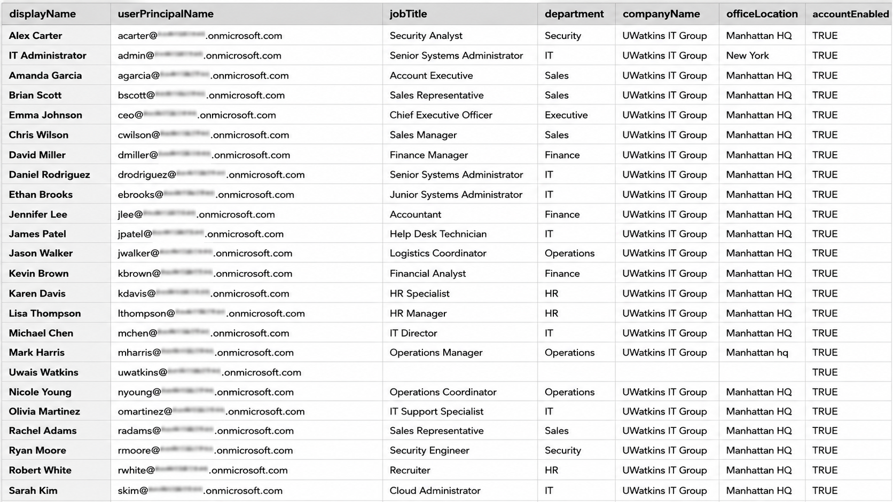

---

## 👤 User Creation Automation

This script creates a new Microsoft Entra ID user through Microsoft Graph.

```bash
python scripts/03_create_user.py
```

**Business value:** Automates a common onboarding task that would normally be performed manually in the admin portal.

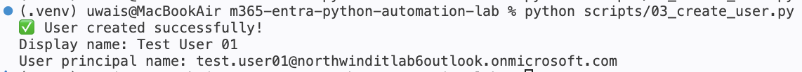

The newly created user was verified in the Microsoft Entra admin center.

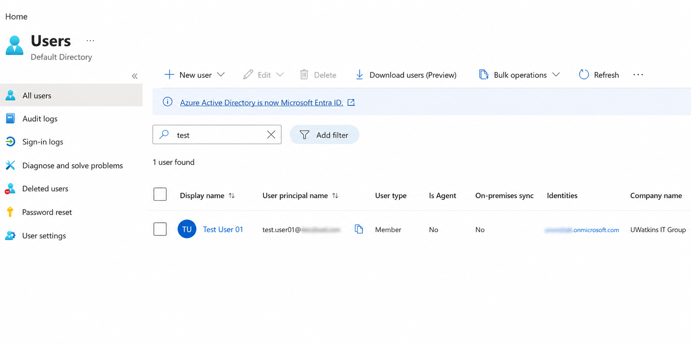

---

## 🚫 User Disable Automation

This script disables a Microsoft Entra ID user account.

```bash
python scripts/04_disable_user.py
```

**Business value:** Simulates a basic offboarding control by disabling account access through automation.

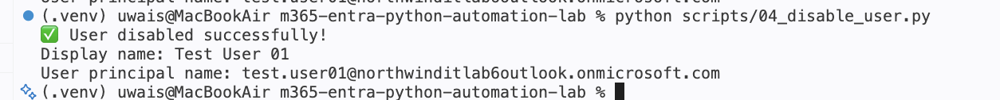

The disabled status was verified directly in Microsoft Entra ID.

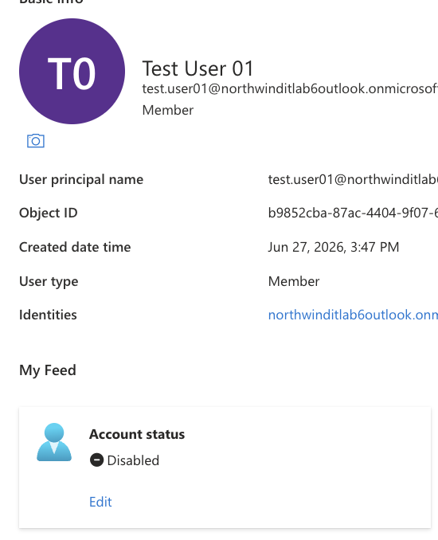

---

## 👥 Add User to Security Group

This script adds a user to the `SG-DEPT-IT` security group.

```bash
python scripts/06_add_user_to_group.py
```

**Business value:** Automates access assignment by placing users into the correct department or role-based security groups.

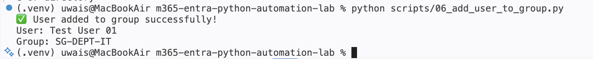

The user was verified as a member of the target security group.

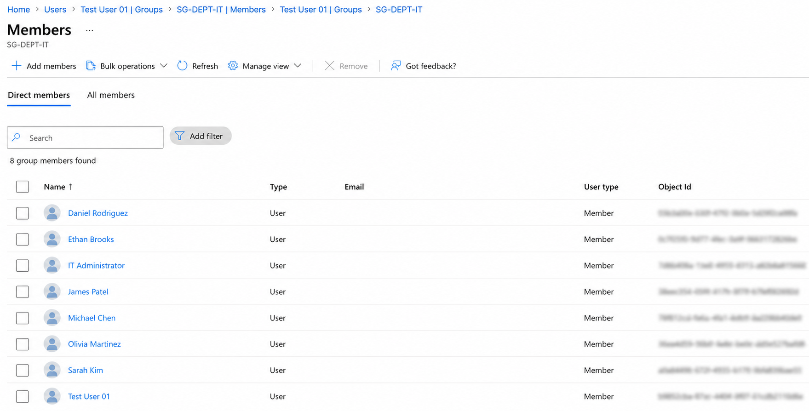

---

## 🔁 Remove User from Security Group

This script removes a user from the `SG-DEPT-IT` security group.

```bash
python scripts/07_remove_user_from_group.py
```

**Business value:** Supports access cleanup during role changes, transfers, or offboarding.

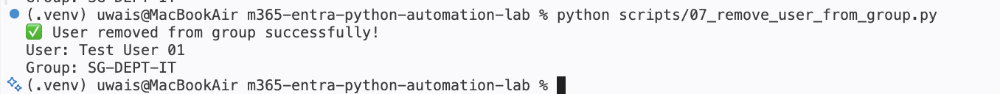

The Microsoft Entra admin center confirms the user was removed from the group.

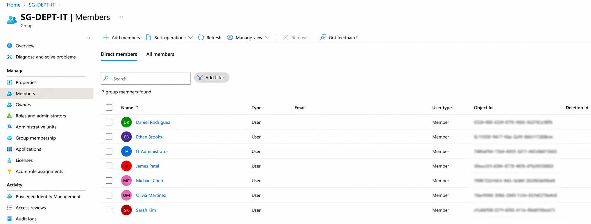

---

## 📝 Update User Attributes

This script updates user profile attributes such as job title and office location.

```bash
python scripts/08_update_user.py
```

**Business value:** Helps keep directory information accurate and aligned with HR or IT records.

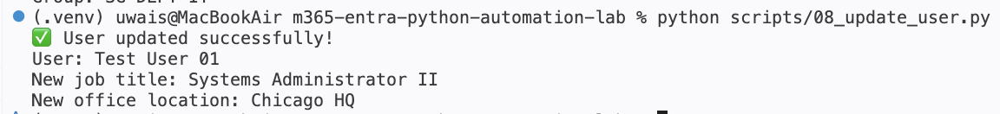

The updated job title and office location were verified in Microsoft Entra ID.

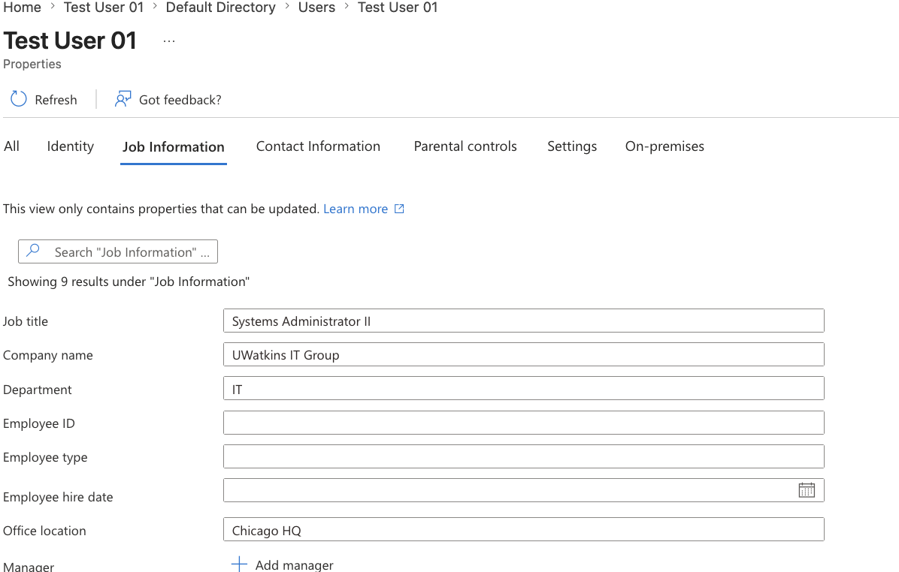

---

## 📦 Bulk User Provisioning

This script reads a CSV file and creates multiple Microsoft Entra ID users in one operation.

```bash
python scripts/09_bulk_create_users.py
```

Input file:

```text
data/new_users.csv
```

**Business value:** Automates bulk onboarding for multiple employees, reducing repetitive manual work.

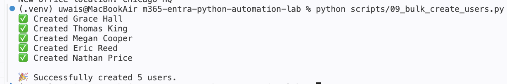

The newly created users were verified in Microsoft Entra ID.

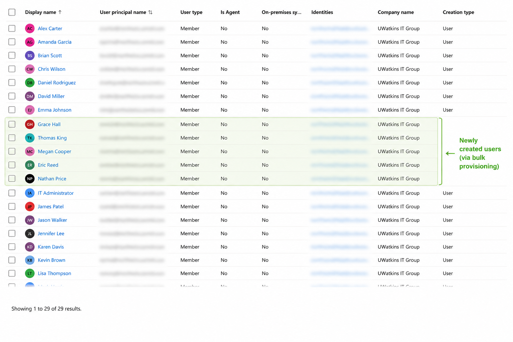

---

## 🧹 Bulk User Offboarding

This script reads a CSV file and disables multiple Microsoft Entra ID users.

```bash
python scripts/10_bulk_offboard_users.py
```

Input file:

```text
data/offboard_users.csv
```

**Business value:** Ensures consistent offboarding by disabling multiple users from a controlled CSV input.

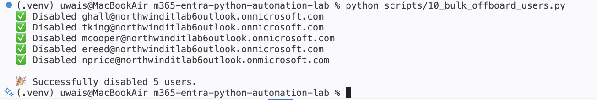

The offboarded users were verified as disabled in Microsoft Entra ID.

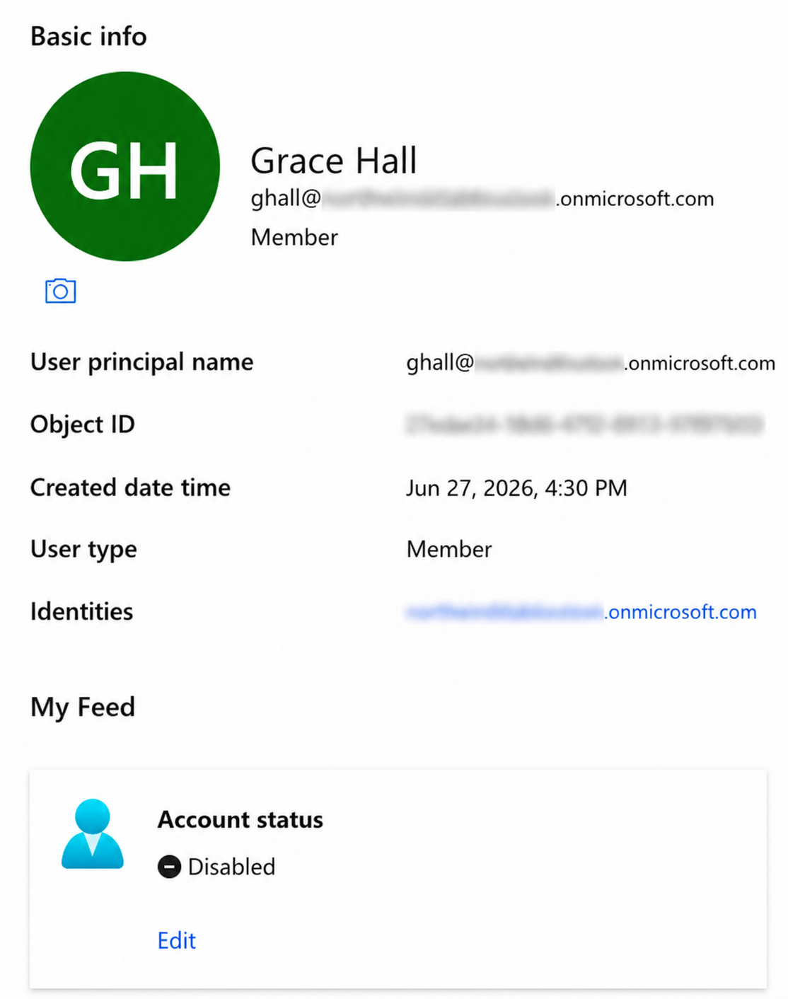

---

## 📊 Department Report

This script generates a department-level report showing enabled and disabled user counts.

```bash
python scripts/11_department_report.py
```

Output file:

```text
outputs/reports/department_report.csv
```

**Business value:** Gives IT teams quick visibility into account status by department for operational review and auditing.

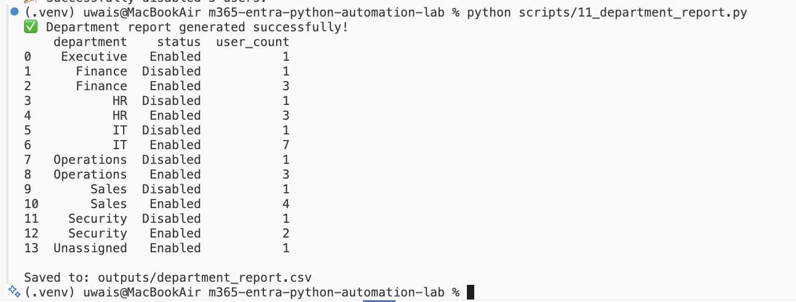

---

## 👥 Group Inventory Report

This script inventories Microsoft Entra ID groups and reports membership counts.

```bash
python scripts/12_group_inventory_report.py
```

Output file:

```text
outputs/reports/group_inventory_report.csv
```

**Business value:** Helps administrators review group usage, access structure, and membership distribution.

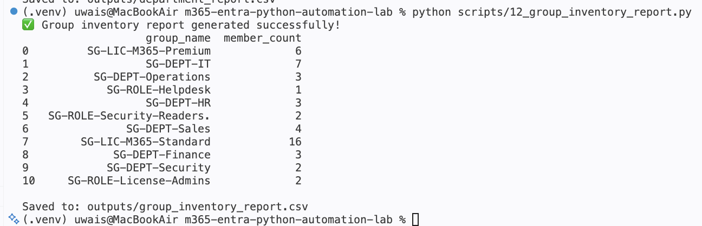

---

## 📄 License Assignment Report

This script generates a report of Microsoft Entra ID users and their assigned Microsoft 365 licenses.

```bash
python scripts/13_license_report.py
```

Output file:

```text
outputs/reports/license_report.csv
```

**Business value:** Provides administrators with visibility into license allocation for auditing, capacity planning, and compliance.

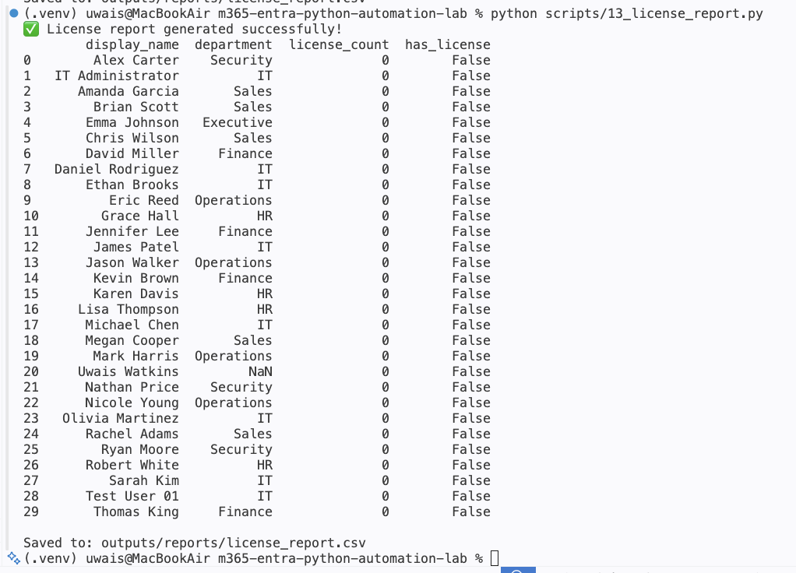

---

## 🧾 Automation Logging

This script demonstrates timestamped logging for automation workflows.

```bash
python scripts/14_logging_demo.py
```

Output folder:

```text
outputs/logs/
```

**Business value:** Logging improves troubleshooting, auditability, and operational visibility for automation tasks.

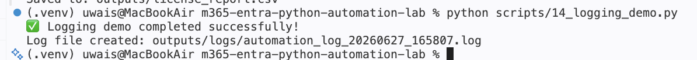

---

## ⚙️ Automation Scripts Summary

| Script | Purpose |
|---|---|
| `01_test_connection.py` | Authenticates to Microsoft Graph and retrieves users |
| `02_export_users.py` | Exports Entra ID users to CSV |
| `03_create_user.py` | Creates a new user |
| `04_disable_user.py` | Disables a user account |
| `06_add_user_to_group.py` | Adds a user to a security group |
| `07_remove_user_from_group.py` | Removes a user from a security group |
| `08_update_user.py` | Updates user profile attributes |
| `09_bulk_create_users.py` | Bulk creates users from CSV |
| `10_bulk_offboard_users.py` | Bulk disables users from CSV |
| `11_department_report.py` | Generates department status report |
| `12_group_inventory_report.py` | Generates group inventory report |
| `13_license_report.py` | Generates license assignment report |
| `14_logging_demo.py` | Demonstrates timestamped automation logging |

---

## 🔒 Security Concepts Demonstrated

This project demonstrates several important security and administration concepts:

- App-based authentication
- Least-privilege API permission planning
- Microsoft Graph application permissions
- Secret management using environment variables
- User lifecycle management
- Account disablement for offboarding
- Group-based access management
- Audit-friendly reporting
- Logging for troubleshooting and accountability

---

## 🧠 Skills Proven

This project demonstrates hands-on ability to:

- Automate Microsoft 365 administration with Python
- Authenticate to Microsoft Graph using app credentials
- Read and write Microsoft Entra ID user data
- Manage user lifecycle workflows
- Manage security group membership
- Process CSV files for bulk operations
- Generate operational reports with Pandas
- Structure a professional GitHub portfolio project
- Document technical work clearly for recruiters and hiring managers

---

## 🚀 How to Run This Project

### 1. Clone the repository

```bash
git clone https://github.com/waisyrr/m365-entra-python-automation-lab.git
cd m365-entra-python-automation-lab
```

### 2. Create and activate a virtual environment

```bash
python -m venv .venv
source .venv/bin/activate
```

### 3. Install dependencies

```bash
pip install -r requirements.txt
```

### 4. Create a `.env` file

Create a local `.env` file in the project root:

```text
TENANT_ID=your_tenant_id
CLIENT_ID=your_client_id
CLIENT_SECRET=your_client_secret
```

### 5. Run the scripts

Example:

```bash
python scripts/01_test_connection.py
```

---

## 📈 Final Outcomes

This lab successfully demonstrates an end-to-end Microsoft 365 identity automation workflow.

Completed capabilities include:

- ✅ Microsoft Graph authentication
- ✅ User inventory export
- ✅ User creation
- ✅ User disablement
- ✅ Security group membership automation
- ✅ User attribute updates
- ✅ Bulk user provisioning
- ✅ Bulk user offboarding
- ✅ Department reporting
- ✅ Group inventory reporting
- ✅ Automation logging

---

## 🧾 Resume-Ready Impact

Built an enterprise-style Microsoft 365 / Entra ID automation lab using Python and Microsoft Graph API to automate user provisioning, offboarding, group membership management, CSV-based bulk operations, inventory reporting, and logging.

---

## 🔮 Future Improvements

Potential future enhancements:

- Add command-line arguments with `argparse`
- Add reusable helper functions for Microsoft Graph authentication
- Add structured JSON logging
- Add error handling and retry logic for failed API calls
- Add license assignment automation if assignable licenses are available
- Add Microsoft Teams or email notifications
- Add GitHub Actions workflow for linting
- Add Azure Automation runbook version

---

## ✅ Project Status

**Completed.**

This project demonstrates practical Microsoft 365 administration, identity management, Python automation, API integration, reporting, and security-focused IT operations.